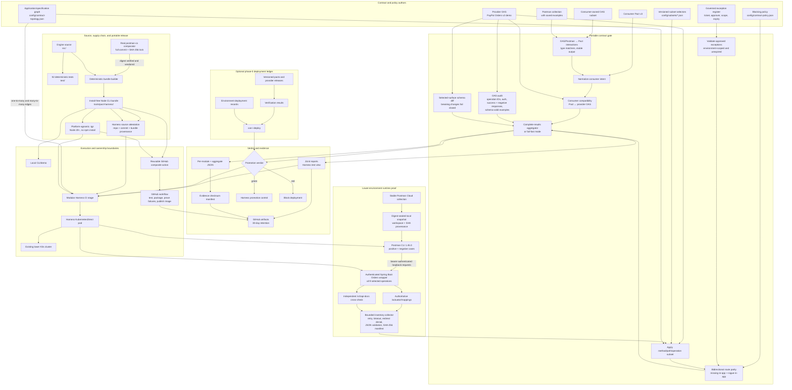
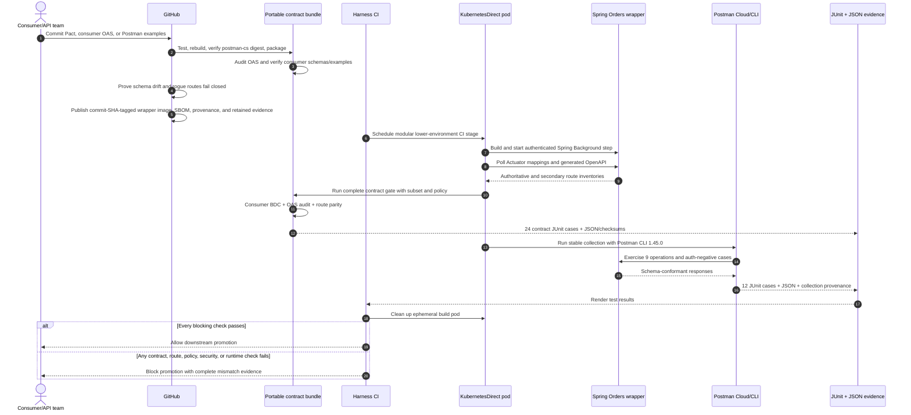

# Contract-gate architecture and execution flow

This repository owns the contract logic, its portable release, the Orders v2
proof application, and executable integrations for GitHub Actions, Harness,
Kubernetes, and Postman. Neither GitHub nor Harness contains a second copy of
the verdict logic: both invoke the same install-free bundle.

## System map

## End-to-end execution

## Responsibility split

| Component | Responsibility |
| --- | --- |
| Repository bundle | Contract semantics and deterministic verdicts |
| Consumer teams | Executable consumer intent: Pact, OAS subset, or Postman examples |
| Provider/application teams | Candidate OAS and runtime implementation |
| Postman | API collaboration artifacts and CLI execution of a workspace- and digest-verified Collection snapshot |
| GitHub | Source validation, portable packaging, failure proofs, evidence retention, and image publication |
| Harness | Kubernetes execution, JUnit presentation, and deployment/promotion control |
| Kubernetes | Ephemeral lower-environment runtime isolation |
| Optional git ledger | Low-infrastructure version/deployment compatibility history |
