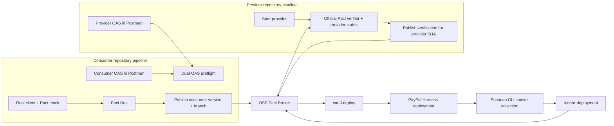

# Postman-first Pact CDC runbook

## The answer to PayPal's feedback

PayPal is correct that a provider-OAS-versus-provider-implementation check is not
consumer-driven contract testing. This repository now separates three useful
signals instead of describing them as one thing:

1. **Postman design preflight** — pull the consumer and provider OAS documents
   from their declared Postman workspaces, prove workspace membership, validate
   and digest-seal them, then run the repository's static BDC engine.
2. **Executable consumer contract** — the consumer's test runs its real API client
   against a Pact mock and publishes the resulting pact to an OSS Pact Broker.
3. **Provider verification** — the provider pipeline uses the official Pact
   verifier, deterministic provider states, Broker selectors, pending/WIP pacts,
   and publishes the result for that exact provider version.

The first signal is the open-source functionality already rebuilt in this repo.
It is retained because it catches design, schema, security, and route drift early.
The second and third signals close the lifecycle gaps PayPal identified. PactFlow
is not required: the CLI and Pact Broker paths described here are open source.

## Product ownership boundary

| Concern | Primary system | Why |
| --- | --- | --- |
| Consumer and provider OAS source of truth | Postman workspaces / Spec Hub | Collaboration, review, governance, and discoverability stay in the Postman product suite. |
| Design compatibility | This repo's static BDC gate | Fast consumer-OAS × provider-OAS feedback before a live provider exists. |
| API examples and behavioral suites | Postman Collections | Human-readable scenarios remain reusable for development, CI, and lower-environment smoke tests. |
| Collection execution and reports | Postman CLI | Positive/negative behavior and JSON/JUnit evidence from a workspace- and digest-verified Cloud snapshot. |
| Consumer-code interaction capture | Pact framework in each consumer repo | Only the consumer test can prove its real client produced and handled the interaction. |
| Contract matrix and environment state | OSS Pact Broker | Versioned pacts, verification results, selectors, pending/WIP, deploy decisions, and deployments. |
| Promotion orchestration | Harness | Harness runs the gates, deployment, Postman smoke checks, and post-success recording. |

Postman therefore remains the API system of engagement and the dominant test
surface. Pact is a narrow interoperability layer for the consumer-owned contract
matrix that Postman does not natively model.

## Correct topology

Do not put consumer pact generation in the provider pipeline. Do not generate the
production pact from the provider OAS. Do not record a deployment before the real
deployment and required Postman smoke checks succeed.

## Harness building blocks

Import these stage objects into the pipelines that own the corresponding event:

| File | Owner and placement |
| --- | --- |
| `harness/stages/postman-oas-preflight.yaml` | Consumer or provider design pipeline; pulls **both** OAS documents from Postman and runs static BDC. |
| `harness/stages/consumer-contract-gate.yaml` | Existing Postman-first lower-runtime gate; route parity, schemas, positive/negative Postman Collection cases, JUnit, and evidence sealing. |
| `harness/stages/pact-consumer-publish.yaml` | Consumer pipeline; runs the configured executable Pact test command and publishes its output in one CI stage. |
| `harness/stages/pact-provider-verify.yaml` | Provider pipeline after the provider is started and its state endpoint is available. |
| `harness/stages/pact-can-i-deploy.yaml` | Immediately before the existing PayPal deployment/promotion stage. |
| `harness/stages/pact-record-deployment.yaml` | After deployment and any required Postman CLI smoke collection succeed. |

The phase-0 Git ledger remains available for a disconnected demo. It is not a
replacement for Broker selectors, pending/WIP, or environment-aware deployment
state and should not be the production system of record.

## Required Harness configuration

Create references, never literal credentials, for:

| Secret | Purpose |
| --- | --- |
| `paypal_postman_service_account_pmak` | Read the two authorized Postman workspaces and run Cloud collections. |
| `paypal_pact_broker_password` | Basic-auth password for publishing pacts/results and reading/writing deployment state on the self-managed OSS Broker. |
| `paypal_pact_provider_bearer_token` | Authenticate official verifier requests to the provider. |
| `paypal_contract_demo_token` | Existing lower-environment Postman and route proof. |

The self-contained lower proof uses `paypal_contract_demo_token` on both sides of
the demo provider call. The reusable production verifier uses the service-specific
`paypal_pact_provider_bearer_token`.

Runtime inputs must supply both Postman workspace IDs and Spec Hub IDs, Pact
participant names, Broker URL, target environment, and the date from which WIP
pacts are included. The complete lower Broker proof also requires an independently
reviewed full source SHA plus explicit consumer and provider logical Pact branches.
Do not derive those values from the selected branch/tag, pull-request target, or a
manual-run default. Use the immutable Git commit SHA as every application version;
never publish mutable labels such as `latest` as a version.

The checked-in Pact CLI lock pins the Linux/Amd64 release URL, byte count, and
SHA-256. The installer rejects other platforms, repositories, redirect hosts,
sizes, or digests. Credentials are passed through the environment and are not written
to the repository or reports. Pact usage telemetry is disabled in every official
CLI stage with `PACT_DO_NOT_TRACK=true`.

## Consumer pipeline

1. Lint and govern the consumer OAS in Postman.
2. Run `postman-oas-preflight.yaml` against the consumer and provider Spec Hub
   IDs plus their reviewed `sourceCanonicalSha256` values from the binding config.
3. Choose a new workspace-relative `pacts_path` for the execution, such as
   `pacts/<+pipeline.executionId>`. The publish stage creates it and exports it as
   `PACT_OUTPUT_DIR`; configure the language Pact library to write there.
4. Run the consumer unit suite with the language Pact library and real production
   API client. Assert both request construction and response handling. A no-op,
   pre-existing output directory, or Pact with zero interactions fails closed.
5. Publish only after the tests pass, using the consumer Git SHA and an explicitly
   supplied logical branch rather than trigger-derived branch metadata.
6. Optionally run the consumer Postman Collection for complementary scenarios.

A Pact is the consumer's statement: "given provider state S, when my code sends R,
I require response M." It should express the minimum the consumer relies on, not
copy the provider's entire response or OAS.

## Provider pipeline

1. Start the provider version being built; do not verify a shared drifting service.
2. Expose a CI-only provider-state endpoint that creates deterministic synthetic
   prerequisites and is inaccessible in production.
3. Run `pact-provider-verify.yaml`. Its selectors cover main-branch, deployed or
   released consumers, and matching branches; pending and WIP pacts allow safe
   introduction without suppressing established regressions.
4. Publish the verification using the provider Git SHA and branch.
5. Run Postman's route/schema/security and collection gates as complementary
   provider conformance evidence.

The verifier deliberately does not use `--ignore-no-pacts-error`: an empty or
misconfigured Broker selection fails closed.

## Deploy pipeline

1. Run `pact-can-i-deploy.yaml` for the exact participant SHA and target
   environment. `unknown` is retried briefly and then blocks.
2. Run PayPal's existing deployment stage.
3. Run the target-environment Postman smoke Collection if required by the service.
4. Only then run `pact-record-deployment.yaml` for that same SHA and environment.

`can-i-deploy` is a question about known compatibility with the versions currently
deployed in an environment. `record-deployment` changes that environment state.
Reversing these operations corrupts the decision graph.

## Rollout plan

1. **Shadow:** keep existing gates blocking; publish and verify Pacts without using
   their deploy verdict. Confirm participant naming, branches, and selectors.
2. **Lower blocking:** make Pact verification and `can-i-deploy` blocking in lower.
   Keep Postman behavioral and static gates blocking too.
3. **Production blocking:** add the gate before promotion and record only successful
   deployments. Add Broker webhooks to trigger provider verification when consumer
   pacts change.
4. **Scale:** standardize consumer language templates, provider-state conventions,
   retention, Broker backups, SSO/token rotation, and ownership dashboards.

## How to read failures

| Failure | Owner | Typical fix |
| --- | --- | --- |
| Consumer OAS not in declared workspace | API program / Postman workspace owner | Correct the workspace/spec pairing or permissions. |
| Static BDC mismatch only | Consumer and provider API designers | Reconcile the OAS surfaces or narrow the consumer contract intentionally. |
| Consumer Pact test fails | Consumer team | Fix client behavior or the expectation before publication. |
| Established provider interaction fails | Provider team | Preserve behavior or coordinate a compatible migration. |
| New pending/WIP interaction fails | Consumer team first | Confirm the new expectation and coordinate implementation; established releases remain unblocked. |
| `can-i-deploy` is unknown | Platform/contract owner | Repair missing publication, verification, version, environment, or participant metadata—do not bypass it. |
| Postman smoke fails after deploy | Provider/runtime owner | Roll back or repair before recording deployment. |

## Recommended videos

- [PactFlow — The problem with end-to-end integrated tests](https://www.youtube.com/watch?v=U05q0zJsKsU) explains why shared integrated environments create slow, ambiguous feedback and why contracts move the signal earlier.
- [PactFlow — Contract testing with Pact JS demo](https://www.youtube.com/watch?v=6Qd-kq1AzZI) walks through consumer tests, publishing, provider verification, Broker results, and `can-i-deploy` in CI.

Follow those with the official [How Pact works](https://docs.pact.io/getting_started/how_pact_works),
[provider verification](https://docs.pact.io/getting_started/provider_verification),
[Pact CLI](https://docs.pact.io/implementation_guides/cli/pact-cli), and
[`can-i-deploy`](https://docs.pact.io/pact_broker/can_i_deploy) documentation.
